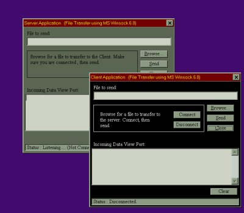



## An Absolute Must Have for Network Programmers\!

### Description

The most comprehensive, user friendly, and effective file transfer method using MS Winsock (Ver6.0) available. Well commented code and a descriptive user interface. Seperate project in zip for both client and server, including exe's.

Feedback welcome. If you find this code useful please take a second to

vote for it!
 
### More Info
 
This code was designed on and for sysrems running Windows NT 4.0 (Service Pack 3). Although it may function correctly under Win 9x. It has not been tested under any other OS.

             |
---                |---
**Submitted On**   |2000-03-29 02:12:32
**By**             |[dcroft  \<aka gh0ul\>](https://github.com/Planet-Source-Code/PSCIndex/blob/master/ByAuthor/dcroft-aka-gh0ul.md)
**Level**          |Intermediate
**User Rating**    |4.7 (98 globes from 21 users)
**Compatibility**  |VB 5\.0, VB 6\.0
**Category**       |[Internet/ HTML](https://github.com/Planet-Source-Code/PSCIndex/blob/master/ByCategory/internet-html__1-34.md)
**World**          |[Visual Basic](https://github.com/Planet-Source-Code/PSCIndex/blob/master/ByWorld/visual-basic.md)
**Archive File**   |[CODE\_UPLOAD43713292000\.zip](https://github.com/Planet-Source-Code/dcroft-aka-gh0ul-an-absolute-must-have-for-network-programmers__1-6871/archive/master.zip)

